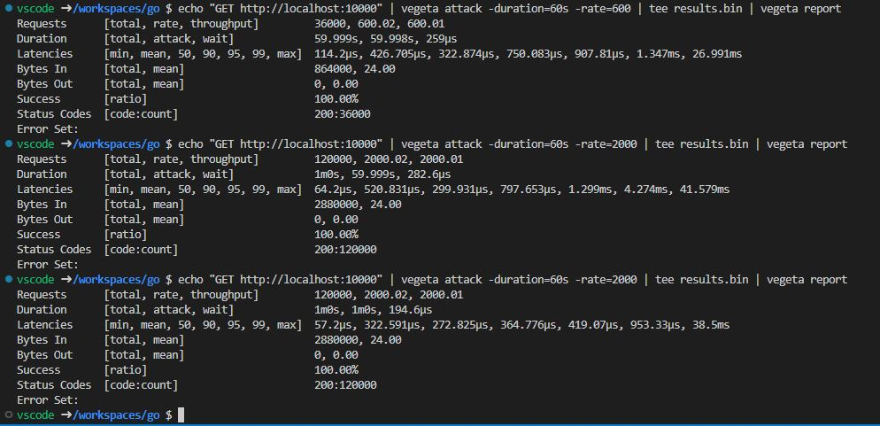

# Go Rest API - CRUD Operations and stress test

This is a simple Rest API written in Go lang and stress tested using [Vegeta](https://github.com/tsenart/vegeta)

## To start the web service

Run below command in your Go dev container:
```
go run main.go
```

## Get Vegeta in Go Dev container

- Connect to your Go Dev container in VS Code Terminal
- Download the latest binary version to install Vegeta inside your container

```
wget https://github.com/tsenart/vegeta/releases/download/v12.8.4/vegeta_12.8.4_linux_amd64.tar.gz

```

- Unpack the binary file
```
tar xfz vegeta_12.8.4_linux_amd64.tar.gz
```

Move the binary file into /usr/bin to make it available system-wide. This step actually installs the Vegeta application in your Dev container:

```
mv vegeta /usr/bin/vegeta
```

## Running a load test with Vegeta

To run a load test during 60 seconds, run the following command.

```
echo "GET http://localhost:10000" | vegeta attack -duration=60s -rate=600 | tee results.bin | vegeta report
```

## Stress test result in dev container




_Caution: This stress test with rate 2000 requests per second for 60 seconds increased my CPU temperature from 44 degree celcius to 75+ degree celcius._

---

This template references an image that was [pre-built](https://containers.dev/implementors/reference/#prebuilding) to automatically include needed devcontainer.json metadata.

* **Image**: mcr.microsoft.com/devcontainers/go ([source](https://github.com/devcontainers/images/tree/main/src/go))
* **Applies devcontainer.json contents from image**: Yes ([source](https://github.com/devcontainers/images/blob/main/src/go/.devcontainer/devcontainer.json))


---
